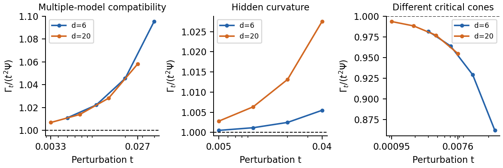
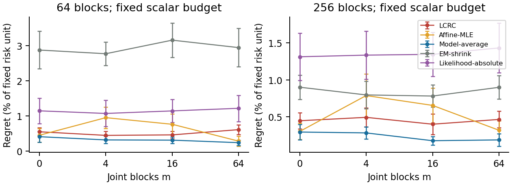

# LCRC 初稿与预热实验解读

本仓库公开算法推导与 Gate 0/1、S2、S3 的 CPU 预热实验；完整论文初稿属于另行维护的研究文档。真实 A 股回测和 LF-PQP 未运行。

## 当前最重要的判断

**理论主线可以写成一篇可讨论的研究初稿；当前 LCRC 实现还没有形成算法领先的证据。**
局部几何的精确系数通过了本轮结构核查。困难出现在统计集合的计算：有限 cell 的似然上界太保守，在当前实验中始终保留整个参数盒。于是算法等同于不使用新数据的完整集合稳健组合。

更关键的是，整个先验盒本来就允许一个足够好的共同组合。它的损失上界约为固定风险单位的 1.853%，低于预设最小容忍度 5%。因此证书全部通过不能说明学习有效：不看数据也能通过。这个负结果提示下一步应先研究“证书何时确实需要信息”，而不是马上增加回测。

## 理论与证明

- T1：在固定有限模型、共同基准最优解、统一强凸和固定多面体约束下，推导 Γ_t=t²Ψ+O(t³)，给出交锥上的共同决策与相同常数的对偶。统计不可改善结论另需扰动市场始终观察等价。
- 多模型反例：给出 d 资产的实际协方差构造；每对模型可共用 ε 近优组合，整体却不行。Helly 和 Carathéodory 是经典工具，未包装为新定理。
- T2/T3/T4：证明平方根 regret 稳定性、有限组兼容信息界与连续外覆盖证书。T3 不是一般模型族下的最优样本复杂度，更未证明所有常数紧。
- 新补充：给出完整 mask 分组似然的统一 Hessian 余项界；说明随机置信集下界、外覆盖优化下界与统计 minimax 下界的区别。
- 完整附录还说明最不利先验后验 QP 的标准决策对偶，但本轮没有实现该备选算法。

## 实验结果

Gate 0：15 个独立 QP 审计、L1 对偶、中心交叉检查、似然等价与分组、off-grid 覆盖和 100 次稳定性检查通过；另有 120 次有限模型覆盖诊断。S1 共 120 个结构记录。S2 共 160 个实例 × 7 种方法；S3 共 160 个设置实例 × 7 种方法（cell 预算对照复用同一数据，不能当作独立样本）。

| 总块数 | 联合块数 | LCRC | Affine-MLE | 模型平均 | EM＋收缩 |
|---:|---:|---:|---:|---:|---:|
| 64 | 0 | 0.553% | 0.454% | 0.413% | 2.878% |
| 64 | 4 | 0.450% | 0.955% | 0.321% | 2.773% |
| 64 | 16 | 0.464% | 0.766% | 0.315% | 3.160% |
| 64 | 64 | 0.614% | 0.286% | 0.243% | 2.948% |
| 256 | 0 | 0.447% | 0.303% | 0.295% | 0.900% |
| 256 | 4 | 0.493% | 0.787% | 0.282% | 0.796% |
| 256 | 16 | 0.400% | 0.654% | 0.177% | 0.781% |
| 256 | 64 | 0.465% | 0.318% | 0.188% | 0.899% |

表中是 regret / 固定训练风险单位，不是收益率。越低越好；每格 20 次重复，配对区间另见 results/paired.csv。
八格等权汇总后，LCRC 的平均 regret 比模型平均高 74.0%。它优于若干其他方法不能抵消这个强基线结果。模型平均的均匀先验与本轮真参数生成分布匹配，因此其平均损失优势有合理解释；不能把它反过来宣称为所有市场的最佳方法。

CPU 十实例试跑：七方法合计中位 0.434 秒，p95 0.583 秒，Python 进程峰值工作集约 162.6 MiB。128-cell 的 LCRC 单方法中位耗时约 7.60 秒，却未得到更窄覆盖。

## 为什么不能把覆盖率当作胜利

S2 的 160 次真实 regret 都低于证书，但这来自覆盖过宽与风险盒较温和，而非证明信息使用充分。S3 的族外协方差扰动出现 1/20 次超出名义证书；此处没有严格覆盖承诺。每格 20/20 覆盖对应的 95% 二项区间下端只有约 83.2%，并不足以实证确认 95% 覆盖。

## 修改与保留的失败

首次 Gate 0 发现对偶优化的原始目标尺度太小，停止时 gap 约 2.3e-7；归一化目标后审计 gap 约 2.6e-11。这是数值停止规则修复。
首次性能运行后发现：完全未被观察的 MLE 坐标会因网格顺序取边界。最终版本对严格不可识别坐标统一取盒中心，保持似然不变。已用同一数据种子重跑；原结果保存于 results/initial_mle_ties，未隐藏或按表现选择。
PDF 图形检查又发现边界场景的对偶界过松，旧 Gate 1 允许用过大的数值 gap 解释任意偏差，造成错误通过。已修复无自由坐标时的预算乘子区间，并增加顶点回归检查；Gate 1 现在先限制 gap，再检查理论系数。修复后的 6/20 资产边界比值分别趋近 0.2455/0.2485，理论值为 0.25。旧记录保存在 results/initial_boundary_bounds；依赖的性能实验也重跑。
EM 的收缩系数由独立验证集选为 1.0，因此最终 EM 对照实际为对角风险估计。保留这一结果，没有为了让主算法占优强制更弱的收缩值。

## 文件与下一步

- docs/ALGORITHM_DERIVATIONS.md：算法推导、似然校准、QP 对偶和连续覆盖证明。
- docs/EXPERIMENTAL_PROTOCOL.md：实验协议与复现边界。
- core.py、experiments.py：算法、评估隔离、结构生成器与复现入口。
- results/summary.csv、paired.csv、逐实例 Parquet：结果及配对比较。
- THEORY_AUDIT.md：推导核查、近邻与声明范围。

最值得继续的工作是收紧连续置信集合的计算，并研究非平凡 ε 下的统计信息界；本轮不通过挑选更有利的 ε 或真参数分布来制造成功。是否有 ICML 级 novelty 仍需外部独立数学审阅与进一步近邻审查。