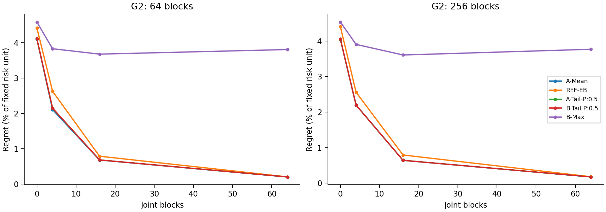
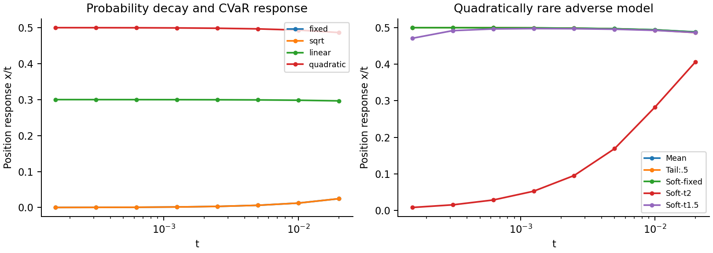

# 条件尾部与似然重加权：v2 研究报告

> 发布说明：以下为实验结束时的统计报告，保留当时的状态描述。此后已按用户要求准备公开报告与核心代码；最新阅读入口为 [详细审阅报告](REVIEW_REPORT_ZH.md)。13.44 小时是累计并行进程时间；清单冻结到最后实验结束实际经过约 2 小时 33 分钟。

本报告只汇总本目录实际存在的记录。方法筛选是探索性研究，不是外部预注册；旧数据和数值修正均保留。
本轮未进行真实 A 股回测，也未推送公开仓库。

**主要判断：原独立确认没有产生稳定胜过 Model Averaging 的算法。最有价值的推进是概率衰减—持仓边界—共同信息量之间的理论链条。**
先读 [中文结论与候选决定](docs/ASSESSMENT_ZH.md)，再按本报告查阅逐项证据；[通俗理论解释](docs/THEORY_EXPLAINED_ZH.md) 与 [完整英文证明 PDF](output/pdf/THEORY_NOTES.pdf) 可分别阅读。
补充筛选修正了原最坏组准则错误，加入 Blend 和两项探索候选。由于原确认集已经查看，repair_confirmation 的文件名仅指所复用的数据清单，其证据身份是探索性，不计入原确认比较。详见 IMPLEMENTATION_HISTORY 与 supplement_exploratory_paired.csv。

## 实际执行状态

| stage | rows | instances | expected_instances | failures | state |
| --- | --- | --- | --- | --- | --- |
| pilot | 60 | 10 | 10.0000 | 0 | completed manifest instances |
| development | 1056 | 24 | 24.0000 | 0 | completed manifest instances |
| G1 | 4320 | 240 | 240.0000 | 0 | completed manifest instances |
| G2 | 34560 | 1920 | 1920.0000 | 0 | completed manifest instances |
| confirm | 51840 | 6480 | 6480.0000 | 0 | completed manifest instances |
| G3_d20 | 1944 | 216 | nan | 0 | completed manifest instances |
| G3_d50 | 1944 | 216 | nan | 0 | completed manifest instances |
| baseline_audit | 1704 | 240 | nan | 0 | completed manifest instances |
| resolution | 432 | 6 | nan | 0 | completed manifest instances |
| blend_development | 48 | 24 | 24.0000 | 0 | completed manifest instances |
| repair_screen | 8640 | 2160 | 2160.0000 | 0 | completed manifest instances |
| repair_confirmation | 12960 | 6480 | 6480.0000 | 0 | completed manifest instances |

## 理论结果与边界

英文完整推导见 [THEORY_NOTES.md](docs/THEORY_NOTES.md)。主要结论在有限模型、共同基准最优解、强凸和固定多面体条件下成立；尚未经过外部审稿或全面优先性确认。

- 概率相对决策尺度的三种速度分别留下硬临界锥、线性软惩罚和消失项；给出局部化、下界、恢复序列及最优方向收敛证明。
- 外层组概率也下降时，条件方法的软项通常是组内一阶惩罚的尾部，而非直接套用全局加权公式。
- 固定温度熵目标具有平均型局部极限；温度为 t² 时，多项式衰减的坏模型仍可能保留硬边界。仅观察温度/t² 不足以判定行为。
- 完整 mask 高斯 affinity 给出带先验赔率的概率上界；Theorem 6 将检验下界嵌入同一收益/损失协方差下的多资产块模型，证明 log(1/t) 量级的共同观察必要性与后验 CVaR 可达性。候选族给定，仍不包括一般连续风险族或最优常数。
- 固定分组下，条件尾部对联合概率质量的总变差扰动有稳定性界，不需要人为给极小外层组加正概率 floor。

## 数值修正与信息权限

固定网格在 G2 中出现低 ESS 与跨积分节点不稳定，触发计划内的重要性积分。使用数据拟合的提议分布，并显式乘先验/提议比；没有再次重复乘似然。G1 使用 128 场景，G2 使用 256 场景。
更换积分后重跑独立开发数据并重新冻结候选；测试清单和数据种子未改变。归档结果不能与当前记录混合汇总。
另外修正了过滤后奇数场景数的整数 Top-k 取整，重新运行开发筛选并重算受影响方法；两项平均候选名称未改变。大场景改用直接 Clarabel 路径后仍以相同 QP 上下界验收，失败则回退；计时需按源代码版本解释。
C-Budget 的内层支持函数改用经修复的 LP 对偶上界；2,232 条历史目标界已经逐条复核，持仓和真实 regret 保持不变。修正后全部满足目标 gap，原界另行归档。
QP 数值 gap、后验积分误差和频率学统计误差分别报告。tail objective 不被解释为 95% 置信证书。

## 原冻结开发筛选

平均表现初选：['H-Conditional-FilterThenK', 'A-Absolute:0.5']；原准则下差情形初选：[]；机制假设：['B-Tail-P:0.25', 'B-Tail-P:0.5']。
这些名单只使用开发集独立未来实现损失。它们不是已经通过确认的赢家；固定边际的理论机制候选可以保留而不宣称平均表现领先。

## G1 实测结果

regret 以固定开发风险单位的百分比表示，不是投资收益率。不同准则的权衡需分开解释。

| method | instances | mean_regret | p95 | median_seconds | open_gaps |
| --- | --- | --- | --- | --- | --- |
| A-Max | 240 | 0.5335 | 1.3953 | 0.2974 | 0 |
| A-Mean | 240 | 0.3724 | 1.1584 | 0.0040 | 0 |
| A-Tail-P:0.25 | 240 | 0.3985 | 1.2583 | 0.2778 | 0 |
| A-Tail-P:0.5 | 240 | 0.3822 | 1.1921 | 0.2271 | 0 |
| A-Tail-U:0.5 | 240 | 0.5222 | 1.3700 | 0.1932 | 0 |
| B-Max | 240 | 0.4660 | 1.4395 | 0.3512 | 0 |
| B-Plugin | 240 | 0.3896 | 1.1458 | 0.0295 | 0 |
| B-Tail-P:0.25 | 240 | 0.3999 | 1.2540 | 0.2878 | 0 |
| B-Tail-P:0.5 | 240 | 0.3823 | 1.1634 | 0.2179 | 0 |
| B-Tail-U:0.5 | 240 | 0.4639 | 1.4315 | 0.1896 | 0 |
| C-Budget:0.25 | 240 | 0.4315 | 1.3072 | 0.1831 | 0 |
| C-LP-Max:0.01 | 240 | 0.4457 | 1.3358 | 0.2456 | 0 |
| C-LP-Tail:0.1 | 240 | 0.4196 | 1.2197 | 0.0286 | 0 |
| C-LR:1.0 | 240 | 0.5313 | 1.3888 | 0.0434 | 0 |
| C-Soft-Cond:0.1 | 240 | 0.3728 | 1.1559 | 0.0598 | 0 |
| C-Soft:0.1 | 240 | 0.3727 | 1.1558 | 0.0175 | 0 |
| H-Conditional-FilterThenK | 240 | 0.4032 | 1.2441 | 0.2008 | 0 |
| REF-EB | 240 | 0.4248 | 1.2044 | 0.0040 | 0 |

## G2 实测结果

regret 以固定开发风险单位的百分比表示，不是投资收益率。不同准则的权衡需分开解释。

| method | instances | mean_regret | p95 | median_seconds | open_gaps |
| --- | --- | --- | --- | --- | --- |
| A-Max | 1920 | 4.7544 | 9.8846 | 0.1623 | 0 |
| A-Mean | 1920 | 1.7699 | 8.7524 | 0.0080 | 0 |
| A-Tail-P:0.25 | 1920 | 1.8164 | 8.6806 | 0.2274 | 0 |
| A-Tail-P:0.5 | 1920 | 1.7770 | 8.7828 | 0.2254 | 0 |
| A-Tail-U:0.5 | 1920 | 5.2104 | 12.5275 | 0.1580 | 0 |
| B-Max | 1920 | 3.9650 | 10.5780 | 0.1798 | 0 |
| B-Plugin | 1920 | 1.7810 | 8.7079 | 0.0280 | 0 |
| B-Tail-P:0.25 | 1920 | 1.8175 | 8.6899 | 0.2495 | 0 |
| B-Tail-P:0.5 | 1920 | 1.7784 | 8.7229 | 0.2339 | 0 |
| B-Tail-U:0.5 | 1920 | 4.3429 | 12.6367 | 0.1909 | 0 |
| C-Budget:0.25 | 1920 | 3.8046 | 11.5606 | 0.1967 | 0 |
| C-LP-Max:0.01 | 1920 | 2.0590 | 10.4963 | 0.1676 | 0 |
| C-LP-Tail:0.1 | 1920 | 3.5408 | 11.6225 | 0.1547 | 0 |
| C-LR:1.0 | 1920 | 4.7772 | 10.5596 | 0.0658 | 0 |
| C-Soft-Cond:0.1 | 1920 | 1.7839 | 8.8804 | 0.2339 | 0 |
| C-Soft:0.1 | 1920 | 1.7838 | 8.8805 | 0.0438 | 0 |
| H-Conditional-FilterThenK | 1920 | 1.7976 | 8.7225 | 0.1953 | 0 |
| REF-EB | 1920 | 1.9978 | 10.0286 | 0.0080 | 0 |

## confirm 实测结果

regret 以固定开发风险单位的百分比表示，不是投资收益率。不同准则的权衡需分开解释。

| kind | method | instances | mean_regret | p95 | median_seconds | open_gaps |
| --- | --- | --- | --- | --- | --- | --- |
| G1 | A-Absolute:0.5 | 720 | 0.5055 | 1.3231 | 0.0737 | 0 |
| G1 | A-Mean | 720 | 0.4162 | 1.0206 | 0.0040 | 0 |
| G1 | A-Tail-P:0.5 | 720 | 0.4220 | 1.0226 | 0.2023 | 0 |
| G1 | B-Max | 720 | 0.5040 | 1.1309 | 0.2998 | 0 |
| G1 | B-Tail-P:0.25 | 720 | 0.4358 | 1.0412 | 0.2784 | 0 |
| G1 | B-Tail-P:0.5 | 720 | 0.4221 | 1.0150 | 0.2072 | 0 |
| G1 | H-Conditional-FilterThenK | 720 | 0.4465 | 1.0411 | 0.2183 | 0 |
| G1 | REF-EB | 720 | 0.4741 | 1.1442 | 0.0040 | 0 |
| G2 | A-Absolute:0.5 | 5760 | 2.0880 | 10.9923 | 0.2197 | 0 |
| G2 | A-Mean | 5760 | 1.8006 | 7.8735 | 0.0080 | 0 |
| G2 | A-Tail-P:0.5 | 5760 | 1.8162 | 8.4847 | 0.2044 | 0 |
| G2 | B-Max | 5760 | 3.4891 | 11.2598 | 0.1727 | 0 |
| G2 | B-Tail-P:0.25 | 5760 | 1.8576 | 9.0077 | 0.2319 | 0 |
| G2 | B-Tail-P:0.5 | 5760 | 1.8171 | 8.4923 | 0.2203 | 0 |
| G2 | H-Conditional-FilterThenK | 5760 | 1.8158 | 8.5019 | 0.1835 | 0 |
| G2 | REF-EB | 5760 | 2.1790 | 11.0515 | 0.0080 | 0 |

## 独立确认的配对比较

区间按风险族均值计算，只有三个独立风险族，跨风险族推断仍然有限。Holm 校正只涉及冻结候选与 MA/EB 两项主要基线；不能从非显著结果推断等效。

| kind | method | baseline | difference | low | high | p | families | paired_instances | interval | p_holm |
| --- | --- | --- | --- | --- | --- | --- | --- | --- | --- | --- |
| G1 | A-Absolute:0.5 | A-Mean | 0.00089 | -0.00025 | 0.00203 | 0.07805 | 3 | 720 | t interval on family means; only three independent families; exploratory approximation | 1.00000 |
| G1 | A-Tail-P:0.5 | A-Mean | 0.00006 | -0.00014 | 0.00026 | 0.34009 | 3 | 720 | t interval on family means; only three independent families; exploratory approximation | 1.00000 |
| G1 | B-Max | A-Mean | 0.00088 | 0.00029 | 0.00146 | 0.02315 | 3 | 720 | t interval on family means; only three independent families; exploratory approximation | 0.55569 |
| G1 | B-Tail-P:0.25 | A-Mean | 0.00020 | -0.00027 | 0.00066 | 0.21153 | 3 | 720 | t interval on family means; only three independent families; exploratory approximation | 1.00000 |
| G1 | B-Tail-P:0.5 | A-Mean | 0.00006 | -0.00010 | 0.00022 | 0.25449 | 3 | 720 | t interval on family means; only three independent families; exploratory approximation | 1.00000 |
| G1 | H-Conditional-FilterThenK | A-Mean | 0.00030 | -0.00002 | 0.00063 | 0.05736 | 3 | 720 | t interval on family means; only three independent families; exploratory approximation | 1.00000 |
| G1 | A-Absolute:0.5 | REF-EB | 0.00031 | -0.00183 | 0.00246 | 0.59335 | 3 | 720 | t interval on family means; only three independent families; exploratory approximation | 1.00000 |
| G1 | A-Tail-P:0.5 | REF-EB | -0.00052 | -0.00173 | 0.00068 | 0.20375 | 3 | 720 | t interval on family means; only three independent families; exploratory approximation | 1.00000 |
| G1 | B-Max | REF-EB | 0.00030 | -0.00087 | 0.00147 | 0.38433 | 3 | 720 | t interval on family means; only three independent families; exploratory approximation | 1.00000 |
| G1 | B-Tail-P:0.25 | REF-EB | -0.00038 | -0.00181 | 0.00104 | 0.36777 | 3 | 720 | t interval on family means; only three independent families; exploratory approximation | 1.00000 |
| G1 | B-Tail-P:0.5 | REF-EB | -0.00052 | -0.00169 | 0.00065 | 0.19557 | 3 | 720 | t interval on family means; only three independent families; exploratory approximation | 1.00000 |
| G1 | H-Conditional-FilterThenK | REF-EB | -0.00028 | -0.00160 | 0.00105 | 0.46403 | 3 | 720 | t interval on family means; only three independent families; exploratory approximation | 1.00000 |
| G2 | A-Absolute:0.5 | A-Mean | 0.00287 | -0.00303 | 0.00878 | 0.17121 | 3 | 5760 | t interval on family means; only three independent families; exploratory approximation | 1.00000 |
| G2 | A-Tail-P:0.5 | A-Mean | 0.00016 | -0.00027 | 0.00058 | 0.25723 | 3 | 5760 | t interval on family means; only three independent families; exploratory approximation | 1.00000 |
| G2 | B-Max | A-Mean | 0.01688 | -0.01734 | 0.05111 | 0.16779 | 3 | 5760 | t interval on family means; only three independent families; exploratory approximation | 1.00000 |
| G2 | B-Tail-P:0.25 | A-Mean | 0.00057 | -0.00084 | 0.00198 | 0.22477 | 3 | 5760 | t interval on family means; only three independent families; exploratory approximation | 1.00000 |
| G2 | B-Tail-P:0.5 | A-Mean | 0.00017 | -0.00027 | 0.00060 | 0.24487 | 3 | 5760 | t interval on family means; only three independent families; exploratory approximation | 1.00000 |
| G2 | H-Conditional-FilterThenK | A-Mean | 0.00015 | -0.00031 | 0.00061 | 0.29310 | 3 | 5760 | t interval on family means; only three independent families; exploratory approximation | 1.00000 |
| G2 | A-Absolute:0.5 | REF-EB | -0.00091 | -0.00397 | 0.00215 | 0.32840 | 3 | 5760 | t interval on family means; only three independent families; exploratory approximation | 1.00000 |
| G2 | A-Tail-P:0.5 | REF-EB | -0.00363 | -0.01175 | 0.00450 | 0.19469 | 3 | 5760 | t interval on family means; only three independent families; exploratory approximation | 1.00000 |
| G2 | B-Max | REF-EB | 0.01310 | -0.01542 | 0.04162 | 0.18671 | 3 | 5760 | t interval on family means; only three independent families; exploratory approximation | 1.00000 |
| G2 | B-Tail-P:0.25 | REF-EB | -0.00321 | -0.01088 | 0.00445 | 0.21304 | 3 | 5760 | t interval on family means; only three independent families; exploratory approximation | 1.00000 |
| G2 | B-Tail-P:0.5 | REF-EB | -0.00362 | -0.01172 | 0.00448 | 0.19452 | 3 | 5760 | t interval on family means; only three independent families; exploratory approximation | 1.00000 |
| G2 | H-Conditional-FilterThenK | REF-EB | -0.00363 | -0.01190 | 0.00464 | 0.19939 | 3 | 5760 | t interval on family means; only three independent families; exploratory approximation | 1.00000 |

当前没有条目同时满足负向配对区间和 Holm 显著性标准；不能将均值排名写成稳定领先。

## 场景精度审计

下表为同一 1024 场景参考目标上的跨 scramble 最大差异。结果差异不超过数值/积分敏感性的方法不被解释为可靠优势。

| size | method | max_scramble_objective_spread |
| --- | --- | --- |
| 128 | A-Absolute:0.5 | 0.0000132 |
| 128 | A-Mean | 0.0000161 |
| 128 | A-Tail-P:0.5 | 0.0000733 |
| 128 | B-Max | 0.0011314 |
| 128 | B-Tail-P:0.25 | 0.0001428 |
| 128 | B-Tail-P:0.5 | 0.0000758 |
| 128 | H-Conditional-FilterThenK | 0.0000795 |
| 128 | REF-EB | 0.0000533 |
| 256 | A-Absolute:0.5 | 0.0000133 |
| 256 | A-Mean | 0.0000161 |
| 256 | A-Tail-P:0.5 | 0.0000705 |
| 256 | B-Max | 0.0011231 |
| 256 | B-Tail-P:0.25 | 0.0001416 |
| 256 | B-Tail-P:0.5 | 0.0000722 |
| 256 | H-Conditional-FilterThenK | 0.0000788 |
| 256 | REF-EB | 0.0000535 |
| 512 | A-Absolute:0.5 | 0.0000091 |
| 512 | A-Mean | 0.0000068 |
| 512 | A-Tail-P:0.5 | 0.0000259 |
| 512 | B-Max | 0.0005985 |
| 512 | B-Tail-P:0.25 | 0.0000992 |
| 512 | B-Tail-P:0.5 | 0.0000268 |
| 512 | H-Conditional-FilterThenK | 0.0000326 |
| 512 | REF-EB | 0.0000119 |

## G1：同一固定真值网格的四种权重

每个风险族的八个固定真值分别按均匀、中心、边界双峰和偏斜权重汇总，再对三个风险族平均。这是有限网格风险，不能解释为连续生成先验的积分。

| method | center | edge-bimodal | skew | uniform |
| --- | --- | --- | --- | --- |
| A-Max | 0.1142 | 1.0308 | 0.2700 | 0.5335 |
| A-Mean | 0.1466 | 0.7797 | 0.2694 | 0.3724 |
| A-Tail-P:0.25 | 0.1247 | 0.8723 | 0.2595 | 0.3985 |
| A-Tail-P:0.5 | 0.1384 | 0.8188 | 0.2710 | 0.3822 |
| A-Tail-U:0.5 | 0.1068 | 1.0012 | 0.2888 | 0.5222 |
| Affine-MLE | 0.8039 | 0.7710 | 0.8111 | 0.7765 |
| B-Max | 0.1204 | 1.0312 | 0.2789 | 0.4660 |
| B-Plugin | 0.1471 | 0.8327 | 0.2833 | 0.3896 |
| B-Tail-P:0.25 | 0.1254 | 0.8768 | 0.2614 | 0.3999 |
| B-Tail-P:0.5 | 0.1399 | 0.8194 | 0.2720 | 0.3823 |
| B-Tail-U:0.5 | 0.1229 | 1.0048 | 0.3006 | 0.4639 |
| C-Budget:0.25 | 0.0999 | 0.9196 | 0.2628 | 0.4315 |
| C-LP-Max:0.01 | 0.3211 | 0.7216 | 0.3923 | 0.4457 |
| C-LP-Tail:0.1 | 0.1155 | 0.8935 | 0.2683 | 0.4196 |
| C-LR:1.0 | 0.1126 | 1.0253 | 0.2753 | 0.5313 |
| C-Soft-Cond:0.1 | 0.1449 | 0.7828 | 0.2683 | 0.3728 |
| C-Soft:0.1 | 0.1449 | 0.7827 | 0.2683 | 0.3727 |
| EM-shrink | 0.6371 | 1.5999 | 0.8373 | 1.0144 |
| Equal-Weight | 17.1205 | 17.6570 | 17.4582 | 17.4928 |
| H-Conditional-FilterThenK | 0.1180 | 0.8948 | 0.2729 | 0.4032 |
| REF-EB | 0.1441 | 0.8165 | 0.2699 | 0.4248 |
| REF-LCRC | 0.1087 | 0.9983 | 0.2996 | 0.5221 |

## confirm：同一固定真值网格的四种权重

每个风险族的八个固定真值分别按均匀、中心、边界双峰和偏斜权重汇总，再对三个风险族平均。这是有限网格风险，不能解释为连续生成先验的积分。

| method | center | edge-bimodal | skew | uniform |
| --- | --- | --- | --- | --- |
| A-Absolute:0.5 | 0.2299 | 0.7948 | 0.4582 | 0.5055 |
| A-Mean | 0.1398 | 0.7059 | 0.3597 | 0.4162 |
| A-Tail-P:0.5 | 0.1311 | 0.7271 | 0.3601 | 0.4220 |
| B-Max | 0.1248 | 0.8726 | 0.4360 | 0.5040 |
| B-Tail-P:0.25 | 0.1265 | 0.7597 | 0.3743 | 0.4358 |
| B-Tail-P:0.5 | 0.1316 | 0.7281 | 0.3596 | 0.4221 |
| H-Conditional-FilterThenK | 0.1155 | 0.7870 | 0.3696 | 0.4465 |
| REF-EB | 0.1453 | 0.6372 | 0.3201 | 0.4741 |

## G3_d20：未知结构和时间变化

下表是六种环境等权汇总后，相对 A-Mean 的配对损失差；负数较好。regret_scaled 使用固定风险单位，realized_risk 是未来 21 日实现的半二阶矩。详细的环境分组和整条路径区间见对应 path_paired.csv。
每种环境仅三条独立路径；12 个滚动窗口不能算作 12 次独立重复。这部分属于压力检验，不给出正式市场优势结论。

| method | realized_risk | regret_scaled |
| --- | --- | --- |
| A-Absolute:0.5 | -0.000008 | 0.000391 |
| A-Mean | 0.000000 | 0.000000 |
| A-Tail-P:0.5 | -0.000009 | -0.000242 |
| B-Max | 0.000204 | 0.002897 |
| B-Tail-P:0.25 | 0.000001 | 0.000016 |
| B-Tail-P:0.5 | 0.000001 | 0.000027 |
| EM-shrink | 0.014774 | 0.364065 |
| Equal-Weight | 0.025421 | 0.604966 |
| H-Conditional-FilterThenK | 0.000004 | 0.000000 |

## G3_d50：未知结构和时间变化

下表是六种环境等权汇总后，相对 A-Mean 的配对损失差；负数较好。regret_scaled 使用固定风险单位，realized_risk 是未来 21 日实现的半二阶矩。详细的环境分组和整条路径区间见对应 path_paired.csv。
每种环境仅三条独立路径；12 个滚动窗口不能算作 12 次独立重复。这部分属于压力检验，不给出正式市场优势结论。

| method | realized_risk | regret_scaled |
| --- | --- | --- |
| A-Absolute:0.5 | 0.000001 | 0.000028 |
| A-Mean | 0.000000 | 0.000000 |
| A-Tail-P:0.5 | 0.000000 | -0.000003 |
| B-Max | -0.000052 | -0.000266 |
| B-Tail-P:0.25 | 0.000001 | 0.000012 |
| B-Tail-P:0.5 | 0.000000 | 0.000004 |
| EM-shrink | 0.003313 | 0.084554 |
| Equal-Weight | 0.009273 | 0.248670 |
| H-Conditional-FilterThenK | 0.000001 | 0.000011 |

## 连续后验独立核验

另在三个风险族的高共同信息、边界真值实例运行两条连续参数 Metropolis 链。该抽样使用完整似然与均匀连续先验，不读取真参数；与 256/512/1024 节点积分比较。以下为 256 节点相对 MCMC 均值决策的诊断。
Rhat/ESS 只是有限链诊断，参考本身有 Monte Carlo 误差；此处没有证明条件尾部积分的全局精度。

| family | max_Rhat | min_ESS | max_MA_weight_distance | max_MA_reference_excess |
| --- | --- | --- | --- | --- |
| 0 | 1.00112654 | 1742.20956530 | 0.00185070 | 0.00000068 |
| 1 | 1.00089411 | 1315.55535423 | 0.00119106 | 0.00000028 |
| 2 | 1.00455939 | 695.78713404 | 0.00066930 | 0.00000004 |

## 加密后的参考与 B-Max 的特殊问题

初始审计发现部分尾部方法对节点较敏感，因而增加 4096 节点参考（32 个外层、128 个内层）。这些审计未用于重新选择确认候选。
G2 在固定外层参数后对隐藏参数仿射，regret 对隐藏参数凸，因此条件最大值可在隐藏参数盒子的角点上精确取得。B-Max 的本表参考使用全部角点与加密后的外层边际；主实验中的 B-Max 是有限场景版本，不能冒称精确连续 minimax。
其余方法仍是数值积分参考，不是连续最优性证明。下表最大目标差使用原始半风险单位；应除以固定 u 后与性能差比较。

| method | size | max_excess | max_weight_distance |
| --- | --- | --- | --- |
| A-Absolute:0.5 | 128 | 0.0000460 | 0.0126231 |
| A-Absolute:0.5 | 256 | 0.0000458 | 0.0125919 |
| A-Absolute:0.5 | 512 | 0.0000064 | 0.0046766 |
| A-Mean | 128 | 0.0000244 | 0.0102345 |
| A-Mean | 256 | 0.0000244 | 0.0102175 |
| A-Mean | 512 | 0.0000051 | 0.0046175 |
| A-Tail-P:0.5 | 128 | 0.0000701 | 0.0118981 |
| A-Tail-P:0.5 | 256 | 0.0000686 | 0.0117255 |
| A-Tail-P:0.5 | 512 | 0.0000260 | 0.0082494 |
| B-Max | 128 | 0.0016450 | 0.0274689 |
| B-Max | 256 | 0.0016440 | 0.0273638 |
| B-Max | 512 | 0.0014712 | 0.0223908 |
| B-Tail-P:0.25 | 128 | 0.0001202 | 0.0143205 |
| B-Tail-P:0.25 | 256 | 0.0001195 | 0.0142740 |
| B-Tail-P:0.25 | 512 | 0.0000551 | 0.0084852 |
| B-Tail-P:0.5 | 128 | 0.0000736 | 0.0121187 |
| B-Tail-P:0.5 | 256 | 0.0000701 | 0.0118029 |
| B-Tail-P:0.5 | 512 | 0.0000261 | 0.0083133 |
| H-Conditional-FilterThenK | 128 | 0.0001145 | 0.0166083 |
| H-Conditional-FilterThenK | 256 | 0.0001139 | 0.0165425 |
| H-Conditional-FilterThenK | 512 | 0.0000129 | 0.0052880 |
| REF-EB | 128 | 0.0000597 | 0.0151056 |
| REF-EB | 256 | 0.0000600 | 0.0151367 |
| REF-EB | 512 | 0.0000126 | 0.0067982 |

## 信息下界的协方差嵌入核验

保存 9600 条两模型、多资产可实现的充分投影实验记录。协方差正定性、仅组内观测的似然一致、完整 QP 与解析持仓一致、完整维度与投影实验的 KL 一致均已检查。
共同观察数设为固定倍数乘 log(1/t)；这里只验证定理子类的机制，不混入 G1/G2 算法排名，也不声称有限尺度模拟证明渐近最优常数。

## 多资产边界机制

已保存 6720 条解析面上优化记录。粗尺度另与完整维度 QP/尾部问题交叉核对；细尺度用显式面上公式避免 oracle 目标相减的精度平台。

## 资源与解释限制

已记录实验进程累计墙钟时间 13.442 小时；各项详见 runtime_ledger.jsonl。短暂的交互核验与首次异常终止没有全部纳入该计时，所以它不是整个研究过程的精确总耗时。
部分独立结构审计与性能实验在不同进程并行；均限制单线程 BLAS，时间来自共享桌面，不属于独占机器基准。
G3 使用近似 bootstrap 参考且包含模型失配，所有统计性能结论均为经验结果。开发集 EB 先验未跨越模型空间强行用于 G3。
一般连续后验的统计最优性、全资产信息下界常数与外部市场优势仍未证明。真实数据后续协议见 docs/REAL_DATA_PROTOCOL.md。
