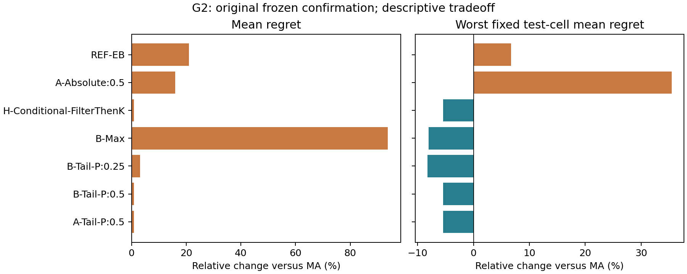

# 研究判断：理论机制成立，算法优势尚未得到确认

> 此文件保留实验结束时的判断。后续发布范围、时间口径与完整实施过程见 [详细审阅报告](../REVIEW_REPORT_ZH.md)；文末“未公开推送”描述的是实验结束当时的状态。

**本轮最值得保留的是“信息何时足以释放持仓边界”的理论问题。现阶段不建议把论文写成条件尾部算法全面优于 Model Averaging。**

## 1. 实验实际回答了什么

原冻结确认集有 6,480 个新实例，覆盖三个新风险族、G1 固定参数风险面和 G2 的八种信息预算。原八种方法全部跑完。相对固定先验 MA，没有入围方法在 G1、G2 的平均 regret 上取得稳定改善；按风险族配对且 Holm 校正后，没有有利的显著比较。非显著不等于方法等效，只有三个风险族也限制了推断。

G2 存在值得观察的平均—最坏测试点权衡：条件尾部 rho=0.25 的最坏测试单元均值约降低 8.3%，平均 regret 约增加 3.2%；rho=0.5 的相应变化约为降低 5.4%、增加 0.9%。这些是相对 MA 的描述性比例，不是收益率改善，也不是总体 minimax 保证。全局尾部 rho=0.5 几乎给出同样结果，因此当前不能把权衡归功于“保护外层后验边际”这一独特机制。

下表的 mean、p95、worst_test_cell 均为固定风险单位 u 的百分比。p95 是跨数据重复的尾部；worst_test_cell 是预定义风险族/参数点/信息预算上的最大均值；二者均不同于算法内部的模型间尾部目标。失败数、数值 gap 和积分诊断必须一起阅读。

| evidence | kind | method | attempted | valid | mean | p95 | worst_test_cell | open_gaps |
| --- | --- | --- | --- | --- | --- | --- | --- | --- |
| original_frozen | G1 | A-Absolute:0.5 | 720 | 720 | 0.50547 | 1.32310 | 1.22643 | 0 |
| original_frozen | G1 | A-Mean | 720 | 720 | 0.41624 | 1.02061 | 0.94563 | 0 |
| original_frozen | G1 | A-Tail-P:0.5 | 720 | 720 | 0.42196 | 1.02258 | 0.95867 | 0 |
| original_frozen | G1 | B-Max | 720 | 720 | 0.50403 | 1.13094 | 1.15266 | 0 |
| original_frozen | G1 | B-Tail-P:0.25 | 720 | 720 | 0.43584 | 1.04119 | 1.01812 | 0 |
| original_frozen | G1 | B-Tail-P:0.5 | 720 | 720 | 0.42212 | 1.01501 | 0.95239 | 0 |
| original_frozen | G1 | H-Conditional-FilterThenK | 720 | 720 | 0.44647 | 1.04111 | 1.01027 | 0 |
| original_frozen | G1 | REF-EB | 720 | 720 | 0.47410 | 1.14424 | 1.17067 | 0 |
| original_frozen | G2 | A-Absolute:0.5 | 5760 | 5760 | 2.08798 | 10.99226 | 21.39096 | 0 |
| original_frozen | G2 | A-Mean | 5760 | 5760 | 1.80061 | 7.87354 | 15.78559 | 0 |
| original_frozen | G2 | A-Tail-P:0.5 | 5760 | 5760 | 1.81622 | 8.48468 | 14.92770 | 0 |
| original_frozen | G2 | B-Max | 5760 | 5760 | 3.48908 | 11.25984 | 14.52103 | 0 |
| original_frozen | G2 | B-Tail-P:0.25 | 5760 | 5760 | 1.85763 | 9.00774 | 14.48204 | 0 |
| original_frozen | G2 | B-Tail-P:0.5 | 5760 | 5760 | 1.81715 | 8.49234 | 14.92935 | 0 |
| original_frozen | G2 | H-Conditional-FilterThenK | 5760 | 5760 | 1.81578 | 8.50189 | 14.92935 | 0 |
| original_frozen | G2 | REF-EB | 5760 | 5760 | 2.17902 | 11.05152 | 16.84459 | 0 |
| supplement_exploratory | G1 | C-LP-Max:0.01 | 720 | 720 | 0.49354 | 1.34081 | 0.86850 | 0 |
| supplement_exploratory | G1 | H-PostSampleK | 720 | 720 | 0.42713 | 1.02658 | 0.96468 | 0 |
| supplement_exploratory | G2 | C-LP-Max:0.01 | 5760 | 5760 | 2.01841 | 9.88463 | 14.53829 | 2 |
| supplement_exploratory | G2 | H-PostSampleK | 5760 | 5760 | 1.82389 | 8.59782 | 14.87769 | 0 |

## 2. 补充筛选为什么只算探索性

原筛选器将“降低最坏组损失”错误地写成“每个组都改善”，使允许付出平均代价的权衡候选和 Blend 触发条件过严。已改为两种方法各自最坏组平均验证损失之差；调参仍只读取独立开发未来收益。原候选、原确认数据和原确认结论保留。
补充开发采用原 24 个实例，加入固定 beta=0.5 的 A-Blend/B-Blend；正确准则选出的差情形候选为 ['H-PostSampleK', 'C-LP-Max:0.01']。补充筛查和测试复用同一冻结清单，而原确认结果已经查看，因此不能把它们重新命名为独立确认。

补充测试的 G2 中，H-PostSampleK 相对 MA 的平均 regret 约增加 1.29%，最坏测试单元约降低 5.75%；C-LP-Max:0.01 分别为增加 12.1%、降低 7.90%。这些比例相对于 MA regret，不是相对于 u 的调参预算。C-LP-Max 在这两个 G2 汇总指标上还被 B-Tail-P:0.25 同时优于，因此尚无理由据此把主方向转向证据惩罚；它在 G1 仍呈现另一种平均—最坏点权衡。
补充的逐方法统计见 repair_screen_summary.csv；相对 MA/EB 的家族配对区间及单独 Holm 列见 supplement_exploratory_paired.csv。多重比较校正不能消除已查看数据后的探索性选择问题。这两项补充候选没有完成新的独立 G3/精度确认，尚不满足最终有效算法标准。

## 3. 哪些负面结果最重要

- **条件化的增量小于目前能可靠分辨的精度。** 条件与全局尾部的平均差远小于部分节点加密敏感性。4096 节点审计中，256 节点条件尾部的最大目标超额约为 7.0e-5（rho=0.5）和 1.2e-4（rho=0.25），是原始目标单位。这个审计不是连续积分误差的严格上界。
- **B-Max 对场景覆盖尤其敏感。** G2 固定外层后可以用隐藏参数盒角点精确求内层最大值；主实验的有限节点版本与此参考有明显差异。主表不可解释为精确连续条件 minimax 的性能。
- **先取最坏 k 个、再归一化概率有实际数值问题。** H-RankThenP 和条件版本的四起点目标差最大约为 0.245u、0.472u，故没有扩大为确认候选；不报告虚假的全局 gap。
- **G3 的近似后验过度集中是重要解释限制。** d=20 的后验 ESS 中位数约 1.99，d=50 约 1.00；对应最大质量中位数约 0.646 和 0.9996。平均、条件尾部和全局尾部因此经常给出非常相近的持仓。这既不是方法等效证明，也不是 bootstrap 质量已正确校准的证据。
- **弱基线不能替代强基线。** G3 中胜过等权或本轮简单 EM 收缩的优势大部分也被 MA 获得，不能据此声称新的风险聚合器有效。

## 4. 理论推进与论文主线

完整证明见 THEORY_NOTES；通俗解释见 THEORY_EXPLAINED_ZH。有限模型、多面体约束和统一强凸下，错误模型概率相对局部持仓尺度 t 的下降速度，分别产生共同临界锥硬限制、线性软惩罚和消失项。证明包含极小点局部化、统一局部展开、下界和恢复序列，而非只在固定活跃集内形式求导。
多资产两模型子类把同一协方差同时用于收益生成和决策风险：组内历史无法区分模型，共同观察才能区分。要求一边 regret=o(t²)、另一边 O(t²)，可证明 log(1/t) 阶共同信息的必要性与后验尾部规则的可达性。匹配的是阶，不是最优常数；候选族给定、只有模型身份未知。
固定正概率时普通 Bayes 平均也会受共同临界锥约束；温度随 t² 缩小的熵平滑甚至可能保留多项式小概率模型的硬限制。这些结果解释了为什么“比 max 平滑”并不自动等于“及时摆脱不可信模型”。
建议主问题改为：**多大的观察证据，足以消除模型歧义对某个持仓方向的限制？** 条件尾部是观察机制的工具之一。目前不支持把成熟 CVaR/Top-k 形式本身写成新贡献，也不支持最小充分统计量或一般连续族最优率的宣称。

## 5. 候选决定

| 类别 | 本轮决定 | 依据 |
|---|---|---|
| 平均表现 | 无确认合格候选 | 未稳定胜过同信息 MA/EB，积分误差仍需控制 |
| 差情形权衡 | H-PostSampleK、C-LP-Max:0.01 保留为补充探索名单；无最终确认候选 | 正确开发准则入围，但补充测试不是新独立确认；尚缺新 G3 和精度支持 |
| 理论机制 | 保留后验尾部 rho=0.5 作为机制研究工具；条件版本仍为待验证假设 | 局部边界与信息链条可证明、可测；当前未证明条件化独有的性能收益 |

下一步先提高并验证条件后验积分精度，在观察等价而持仓边界不同的构造中检验信息阈值；若论文要主张平均或差情形优势，应另开新的冻结确认风险族。不要在已查看的测试集上继续调参，也不宜现在进入真实 A 股来寻找胜率。

## 6. CPU 可行性与可复现性

十个固定实例逐方法测量的中位数如下。冷启动包含场景构造、推断和该次决策；缓存计时复用场景 oracle；均不含解释器启动与模拟数据生成。RSS 是进程驻留内存快照，不能当成整个并行任务的严格峰值。机器为 Core Ultra 5 125H、32GB，BLAS 单线程；共享桌面时序不是独占性能基准。

| method | cold_median_seconds | cold_max_seconds | cached_median_seconds | max_rss_MiB |
| --- | --- | --- | --- | --- |
| A-Mean | 0.4307 | 1.2159 | 0.0061 | 160.2930 |
| A-Tail-P:0.5 | 0.5422 | 1.3367 | 0.1100 | 160.3242 |
| B-Max | 0.5460 | 1.3203 | 0.1265 | 159.5547 |
| B-Tail-P:0.5 | 0.5746 | 1.3228 | 0.1195 | 160.4492 |
| C-Soft:0.1 | 0.4477 | 1.0838 | 0.0336 | 160.7734 |
| H-RankThenP | 3.7224 | 6.6267 | 3.2448 | 159.7383 |

已完成原始 G1/G2、G3 d=20/50、局部边界与信息嵌入、连续后验和场景精度审计。全部失败与修订旧结果保留；四条开发 C-LP-Tail:1.0 的开放 gap 仍如实报告。C-Budget 的 2,232 条目标上下界已用 LP 对偶修复，持仓和真实 regret 未改变。
未完成的一般理论推广、真实数据协议、运行范围和版本修订分别见英文理论笔记、REAL_DATA_PROTOCOL、ALGORITHM_CATALOG 和 IMPLEMENTATION_HISTORY。本轮未执行真实 A 股回测，未公开推送。
