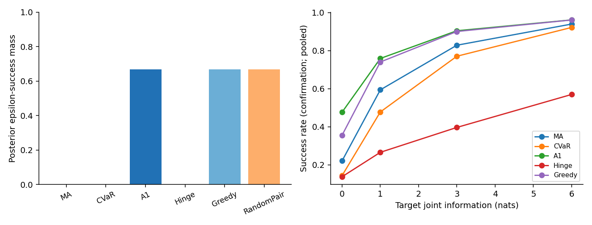
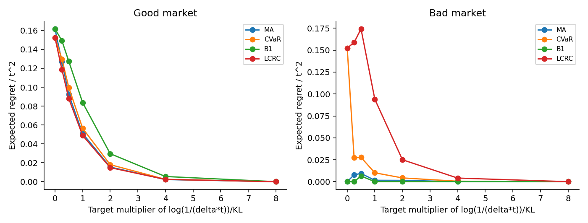
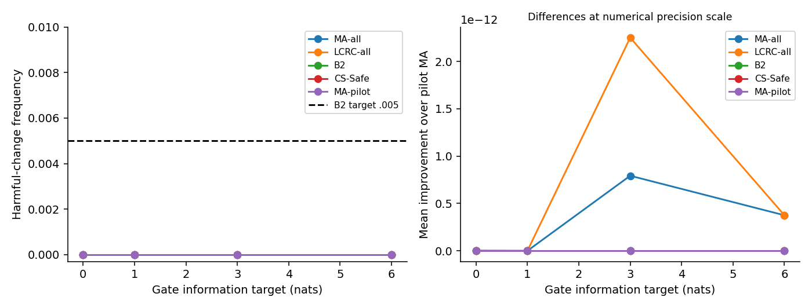

# 决策兼容性与证据闸门实验报告

## 研究问题与证据范围

本轮检验有限模型下两种不同目标：DCL 最大化 regret 不超过 ε 的后验质量；EGPL 在控制错误批准的前提下允许持仓调整。MA 仍是正确后验下的均值最优基线。实验的成功标准是可信判断，不要求新方法获胜。

主要权衡如下。成功率提升以百分点计，平均 regret 增加是相对 MA 的比例，二者不可互换：

| kind | success_gain_pp | mean_regret_increase_percent |
| --- | --- | --- |
| asymmetric | 12.9521 | 47.9831 |
| hidden_curvature | 11.5869 | 46.8745 |
| simplex | 12.8628 | 29.2681 |

B2 与同预算 CS-Safe 在确认数据上的最大逐实例 regret 差为 **0.0**；这一比较使用同一冻结候选库。它直接检查逐候选闸门是否比共享置信集带来额外价值，不能用普通未校准 MA 的错误率代替这个判断。

E1 使用附件的三模型反例，E2 扩展到非对称及隐藏曲率，E3 对应原 Theorem 6 的双模型信息边界，E4 使用独立 pilot／gate 数据测试多方向安全性。E2 本表独立确认状态：**True**。所有真实模型均属于预先给定有限候选族；本轮没有真实股票回测，也没有连续未知协方差保证。

## 实施与公平比较

代码从固定 v2 提交建立独立工作区。每个数据集的所有方法共享候选族、观测与约束；真实模型编号只用于模拟和评价。singleton 历史为每资产 32／256 条，联合样本按公开模型的最小正 pairwise KL 换算信息预算，并保留 100,000 行上限与实际达到的信息量。

高斯充分统计通过 Bartlett/Wishart 精确抽样，模拟的仍是随机数据证据；没有用 KL 期望代替似然。E3 的二维充分统计与完整高维似然已核验。DCL 的 QCQP 在缩放坐标上求解，使用独立 QP 弱对偶计算真实目标上下界。所有 epsilon_ratio=1 的边界行保存在原始结果，主比较排除这一无法稳定区分的数值边界。

计时阶段仅根据运行成本冻结 E2 每单元 50 次、E4 每单元 200 次，独立确认均为 50 次；E1／E3 为 200 次。未根据胜负挑选族或调整 ε。确认阶段非对称／隐藏曲率重新生成模型；标准正单纯形仍是相同解析结构的新数据。

## E1 机制与代理偏差

无共同观测时，下表汇总三个 t 与两种边际历史长度。精确后验质量不需要 Monte Carlo 推断；true_success 的小偏差来自每个模型的有限重复数以及随机 pair 的抽样。

worst_model_failure 是对三个真实模型分别汇总后取最大失败频率；它是有限重复的估计，RandomPair 的理论值为 1/3。

| method | posterior_mass_lower | true_success | regret | worst_model_failure |
| --- | --- | --- | --- | --- |
| A1 | 0.666667 | 0.67 | 9.54625e-05 | 1 |
| CVaR | 0 | 0 | 9.14044e-05 | 1 |
| Greedy | 0.666667 | 0.67 | 9.54625e-05 | 1 |
| Hinge | 0 | 0 | 9.14044e-05 | 1 |
| LCRC | 0 | 0 | 9.14044e-05 | 1 |
| MA | 0 | 0 | 9.14044e-05 | 1 |
| MLE | 0.333333 | 0.335 | 0.000186434 | 1 |
| Minimax | 0 | 0 | 9.14044e-05 | 1 |
| RandomPair | 0.666667 | 0.6825 | 0.000109375 | 0.335821 |

MA、全局 CVaR 和 hinge 在对称构造中返回中心组合，达标质量为零；DCL 和简单贪心可达到 2/3。DCL 的优势因此属于评价目标分离，**不是冲突割优于简单算法的证明**。固定破同分的 DCL 会长期牺牲一个模型，不能把其平均成功率当作最坏模型保证。均匀随机选 pair center 才实现三模型对称的 2/3 成功概率；直接平均三个组合不会获得这个性质。

MA 的均值 regret 更优，与理论一致。所有组合及各真模型指标保存在原始行中。

## E2 非对称与隐藏曲率结果

下表为 ε 比例 0.25、0.5、0.75 的结果，按固定设计与真模型分层后等权平均。最差成功率是有限测试单元上的描述性最小值，不是总体 minimax 保证。regret 保持原始半方差单位，跨不同族的值不能解释成收益率。

| kind | method | true_success | regret | worst_cell_success | attempted | valid |
| --- | --- | --- | --- | --- | --- | --- |
| asymmetric | A1 | 0.81533 | 0.000456722 | 0 | 7200 | 7200 |
| asymmetric | CVaR | 0.621429 | 0.000336106 | 0 | 7200 | 7200 |
| asymmetric | Greedy | 0.777856 | 0.000399527 | 0 | 7200 | 7200 |
| asymmetric | Hinge | 0.417817 | 0.000470839 | 0 | 7200 | 7200 |
| asymmetric | LCRC | 0.482933 | 0.000433331 | 0 | 7200 | 7200 |
| asymmetric | MA | 0.685809 | 0.000308631 | 0 | 7200 | 7200 |
| hidden_curvature | A1 | 0.807258 | 6.97783e-06 | 0 | 4800 | 4800 |
| hidden_curvature | CVaR | 0.639599 | 5.20499e-06 | 0 | 4800 | 4800 |
| hidden_curvature | Greedy | 0.750567 | 6.7832e-06 | 0 | 4800 | 4800 |
| hidden_curvature | Hinge | 0.33305 | 7.74174e-06 | 0 | 4800 | 4800 |
| hidden_curvature | LCRC | 0.451575 | 7.2592e-06 | 0 | 4800 | 4800 |
| hidden_curvature | MA | 0.691389 | 4.75088e-06 | 0 | 4800 | 4800 |
| simplex | A1 | 0.694661 | 0.000296751 | 0 | 7200 | 7200 |
| simplex | CVaR | 0.501063 | 0.000244724 | 0 | 7200 | 7200 |
| simplex | Greedy | 0.671966 | 0.00027734 | 0 | 7200 | 7200 |
| simplex | Hinge | 0.278098 | 0.0003226 | 0 | 7200 | 7200 |
| simplex | LCRC | 0.353675 | 0.000302908 | 0 | 7200 | 7200 |
| simplex | MA | 0.566033 | 0.000229563 | 0 | 7200 | 7200 |

主要配对比较如下，difference 为 A1 减去对应基线的成功率。区间在固定生成族条件下计算；同一数据集的三个 ε 先合并，避免当成独立样本。Holm 只校正预先指定的主要比较，不能消除模型族覆盖有限的限制。

| kind | baseline | difference | ci95_lower | ci95_upper | p_holm |
| --- | --- | --- | --- | --- | --- |
| asymmetric | MA | 0.129521 | 0.123063 | 0.135979 | 0 |
| hidden_curvature | MA | 0.115869 | 0.10911 | 0.122628 | 8.36881e-248 |
| simplex | MA | 0.128628 | 0.122025 | 0.135231 | 0 |
| asymmetric | CVaR | 0.1939 | 0.186356 | 0.201445 | 0 |
| hidden_curvature | CVaR | 0.16766 | 0.159523 | 0.175797 | 0 |
| simplex | CVaR | 0.193598 | 0.184101 | 0.203094 | 0 |

与简单贪心的比较单独列出，未预注册为主优效检验，属于探索性算法增量证据：

| kind | difference | ci95_lower | ci95_upper |
| --- | --- | --- | --- |
| asymmetric | 0.0374736 | 0.0336138 | 0.0413335 |
| hidden_curvature | 0.0566916 | 0.0518019 | 0.0615814 |
| simplex | 0.022695 | 0.0207916 | 0.0245985 |

原始条件后验成功目标上的最优性不自动推出频率学成功优势。即使确认中存在正差异，仍需检查它是否以均值 regret、低概率模型风险或计算耗时为代价。精确状态分布：`{'optimal': 19088, 'open_mass_gap': 112}`。逐单元、p95 regret、超时和模糊成功区间见 CSV 与原始 JSONL。

主比较中 A1 最大剩余质量 gap 为 **9.6883e-07**。HiGHS 的同分选择可能受可行容差影响；非零 gap 保留为 `open_mass_gap`，不能称为精确最优。下表在另外的固定模型与后验上比较冷缓存调用（ε=0.5Γ）；枚举只返回集合最优值，未计入均值破同分，故其时间不能当作完全相同输出的端到端比较。

| d | M | method | wall_seconds | new_gamma_calls | certified_mass |
| --- | --- | --- | --- | --- | --- |
| 3 | 3 | A1 | 0.0126242 | 5 | 0.962166 |
| 3 | 3 | Greedy | 0.0037146 | 3 | 0.962166 |
| 3 | 3 | Enumeration | 0.0048234 | 7 | 0.962166 |
| 6 | 6 | A1 | 0.0570554 | 27 | 0.668295 |
| 6 | 6 | Greedy | 0.010259 | 6 | 0.668295 |
| 6 | 6 | Enumeration | 0.095277 | 63 | 0.668295 |
| 10 | 12 | A1 | 0.323786 | 116 | 0.665873 |
| 10 | 12 | Greedy | 0.024393 | 11 | 0.612577 |

在此六模型样本中冲突割减少了几何子问题数；简单删除更便宜，十二模型样本中则丢失了部分成功质量。这些小规模计时不支持相对通用整数规划的复杂度优势。

## E3 证据与错误批准

好市场最优第二组持仓为 `t/(3+2t)`；两模型曲率不同。B1 用 δ=0.05 的固定时点似然比阈值。下表分别按真实好／坏市场汇总，不将它们混成一个平均 regret 排名。

| truth | multiplier | false_unlock | false_reject | regret_over_t2 |
| --- | --- | --- | --- | --- |
| 0 | 0 | 0 | 1 | 0.161737 |
| 0 | 0.25 | 0 | 0.9225 | 0.149246 |
| 0 | 0.5 | 0 | 0.7875 | 0.127342 |
| 0 | 1 | 0 | 0.5175 | 0.0837322 |
| 0 | 2 | 0 | 0.184167 | 0.0296092 |
| 0 | 4 | 0 | 0.0341667 | 0.00546616 |
| 0 | 8 | 0 | 0 | 0 |
| 1 | 0 | 0 | 0 | 0 |
| 1 | 0.25 | 0 | 0 | 0 |
| 1 | 0.5 | 0.000833333 | 0 | 0.00642559 |
| 1 | 1 | 0 | 0 | 0 |
| 1 | 2 | 0 | 0 | 0 |
| 1 | 4 | 0 | 0 | 0 |
| 1 | 8 | 0 | 0 | 0 |

指标中的有意义解锁统一定义为达到好市场 oracle 持仓的一半，避免把 CVaR 的极小非零持仓和 B1 的全部批准混为一谈；原始文件同时保留任意正入场与实际持仓。B1 只取零或 oracle，两种解锁口径对其一致。

每个主单元只有 200 次重复，稀有事件不能据此认证。另在固定 t 与门槛附近运行独立 10,000 次校准批次，下面给出九项审计经 Bonferroni 调整的单侧区间上限：

| t | multiplier | m | n | errors | rate | simultaneous_95_upper | target |
| --- | --- | --- | --- | --- | --- | --- | --- |
| 0.01 | 0.5 | 7 | 10000 | 0 | 0 | 0.000519161 | 0.0005 |
| 0.01 | 1 | 13 | 10000 | 2 | 0.0002 | 0.00091398 | 0.0005 |
| 0.01 | 2 | 26 | 10000 | 0 | 0 | 0.000519161 | 0.0005 |
| 0.03 | 0.5 | 6 | 10000 | 0 | 0 | 0.000519161 | 0.0015 |
| 0.03 | 1 | 11 | 10000 | 3 | 0.0003 | 0.00108331 | 0.0015 |
| 0.03 | 2 | 22 | 10000 | 1 | 0.0001 | 0.000730817 | 0.0015 |
| 0.1 | 0.5 | 4 | 10000 | 0 | 0 | 0.000519161 | 0.005 |
| 0.1 | 1 | 8 | 10000 | 6 | 0.0006 | 0.00154893 | 0.005 |
| 0.1 | 2 | 16 | 10000 | 3 | 0.0003 | 0.00108331 | 0.005 |

最小 t 的万次模拟区间仍不够窄，因此另开全新种子、预先固定十万次重复的三项精度审计，不与旧样本混合、不修改门槛。下表区间只对这三项新审计作同时校正：

| t | multiplier | joint_rows | n | errors | rate | simultaneous_95_upper | target | upper_below_target |
| --- | --- | --- | --- | --- | --- | --- | --- | --- |
| 0.01 | 0.5 | 7 | 100000 | 3 | 3e-05 | 9.33981e-05 | 0.0005 | True |
| 0.01 | 1 | 13 | 100000 | 3 | 3e-05 | 9.33981e-05 | 0.0005 | True |
| 0.01 | 2 | 26 | 100000 | 2 | 2e-05 | 7.75272e-05 | 0.0005 | True |

理论控制来自似然比的期望恒等式；模拟只能发现异常或衡量功效。B1 的低误批若伴随高错拒，是安全与效率的权衡。该双模型检验与经典 LR 参考相同，不能作为独立新算法胜利。

## E4 多方向安全与收益代价

pilot 样本固定基准、最多六个候选及模型危险集合；gate 数据独立。辅助密度是整个 gate 数据集的固定模型混合。比较同时包括全部数据基线与 pilot-only 基线。B2 在获批候选和基准的凸包内优化。

E4 实际使用 ε=Γ(all)，该阈值仅用于候选生成和总体达标率，不进入安全检验。输出最初把 epsilon_ratio 误标成 0.5，已仅更正为 1，并在 audit_history 保留更正前文件与哈希；观测、实际 ε、持仓和评价数值均未改变。这个宽松且处在边界的达标指标不能替代相对基准的安全—改善评价。

冻结运行期间、查看 E4 性能前增加了 CS-Safe 参照：它在相同 0.005 错误预算下保留一个共享似然置信集，只批准对集合中所有模型都安全的候选。原 LCRC 控制 regret 覆盖，不能直接当作相同安全目标的对照。该修订保存在 configs/safety_reference_amendment.json；新增比较明确标为补充，没有改变原方法或数据。

| method | n | mean_regret | success | p95_regret | harmful | beneficial | mean_change |
| --- | --- | --- | --- | --- | --- | --- | --- |
| A1-all | 400 | 5.57923e-12 | 1 | 6.08853e-12 | 0 | 0.005 | -2.54092e-13 |
| B2 | 400 | 5.82813e-12 | 1 | 6.02608e-12 | 0 | 0 | 0 |
| CS-Safe | 400 | 5.82813e-12 | 1 | 6.02608e-12 | 0 | 0 | 0 |
| CVaR-all | 400 | 9.8033e-12 | 1 | 3.3021e-11 | 0.065 | 0.0025 | 4.67629e-12 |
| CVaR-pilot | 400 | 1.1032e-11 | 1 | 3.04776e-11 | 0.0725 | 0 | 6.00915e-12 |
| Hinge-all | 400 | 0.0111663 | 1 | 0.015498 | 1 | 0 | 0.0111663 |
| LCRC-all | 400 | 5.20482e-12 | 1 | 6.02608e-12 | 0 | 0.005 | -6.57539e-13 |
| LCRC-pilot | 400 | 5.20482e-12 | 1 | 6.02608e-12 | 0 | 0.005 | -6.57539e-13 |
| MA-all | 400 | 5.55769e-12 | 1 | 6.02608e-12 | 0 | 0.005 | -2.91994e-13 |
| MA-pilot | 400 | 5.82813e-12 | 1 | 6.02608e-12 | 0 | 0 | 0 |
| MLE-all | 400 | 5.20482e-12 | 1 | 6.02608e-12 | 0 | 0.005 | -6.57539e-13 |
| MLE-pilot | 400 | 5.20482e-12 | 1 | 6.02608e-12 | 0 | 0.005 | -6.57539e-13 |
| Minimax-all | 400 | 0.0112829 | 0.57 | 0.0171332 | 1 | 0 | 0.0112829 |
| Minimax-pilot | 400 | 0.0112829 | 0.57 | 0.0171332 | 1 | 0 | 0.0112829 |

确认中 B2 每次平均批准候选数为 **0**。harmful 是比 pilot MA 更差的频率，mean_change 为真实风险减去 pilot 基准，负值表示改善。不能仅因 B2 少交易、少犯错就宣称它更有效；应同时观察批准数量、改善幅度及相对全数据 MA 的 regret。

MA／MLE／LCRC／CVaR 的差异主要在 10⁻¹¹ 数值量级，不能把表中微小有害频率解释成有经济意义的损失。Hinge 的零超额目标存在大片平坦区域，返回的组合虽达宽松阈值，其 regret 仍可明显高于几乎已知真模型的 MA。

pilot 诊断中位数如下。若后验质量已接近 1、ESS 接近 1，实验就缺少判断闸门信息效率的空间；本轮保留这一生成器局限，不在确认结果上调整 pilot 强度。

| d | max_pilot_mass | pilot_ESS | candidate_count | entry | exit | near_cap |
| --- | --- | --- | --- | --- | --- | --- |
| 10 | 1 | 1 | 5 | 5 | 5 | 12 |
| 20 | 1 | 1 | 5 | 13 | 12 | 7 |

B2 观察到的危险候选误批数为 **0/400**；把全部确认数据简单汇总所得单侧 95% 二项上限为 **0.00746136**。这是描述性汇总，不是每个真模型／信息单元的同时保证。若上限高于 0.005，则当前模拟精度不足以经验认证该水平；条件性理论保证与模拟诊断必须分开。

数据拆分只保证 gate 校准，并不免费。原始证据文件保存每个候选的密度权重、危险模型、log e-value、批准记录和最终凸组合。几何情形未覆盖及少于两个有效候选的记录均保留，不能事后挑选有利方向。

## 理论与创新边界

已核验的结论是最大兼容质量等价、有效冲突割、E1 随机化下界，以及独立 pilot 条件下多候选错误批准的 union bound 和凸包安全转移。详细证明见 THEORY_STATUS.md。

多正确答案的信息复杂度已有 [Degenne 与 Koolen](https://arxiv.org/abs/1902.03475) 的直接近邻；拆分似然比有效性沿用 [Universal Inference](https://arxiv.org/html/1912.11436v4)。本轮没有证明多模型信息复杂度的匹配上下界，也没有证明优于通用 MILP 的复杂度结果。有限模型机会目标、简单 LR 门槛本身不足以构成新颖主贡献。

最终判定如下：

1. **机制成立。** E1 的 0 与 2/3 分离、MA 均值最优性和 E3 的似然比规则得到核验；多模型兼容性不能由所有模型对兼容替代。
2. **A 有有限范围内的实证价值，B 的扩展不足。** A1 在三类确认设计中相对 MA 提升约 11.6–13.0 个百分点，相对 CVaR 提升约 16.8–19.4 个百分点，但平均 regret 增加约 29%–48%。相对简单贪心的 2.3–5.7 个百分点属于探索性证据。E4 没有产生可评价的获批改善，不能声称 B2 比 LCRC、保守基准或 CS-Safe 更高效。
3. **尚不足以认定形成可投稿的理论／算法增量。** A 值得围绕多模型冲突的信息下界、结构化算法与可扩展性继续研究；仅重述最大可行子系统不够。B1 是已有 LR 工具，B2 本轮没有新效率分离，暂不作为主贡献。

下一阶段应先证明一般非对称族中冲突结构决定的信息复杂度，并预注册更大规模求解对照；若继续 B，需要在全新开发数据上构造 pilot 后仍有决策不确定性的实例，再冻结独立确认。不能在本轮确认数据上调 pilot 强度追求获胜。

## 完整性、计算与限制

本次汇总之前 ledger 累计 CPU 为 **0.4397 小时**，累计进程经过时间为 **0.3994 小时**。二者都不是并行任务的桌面总经过时间；最终数值由 delivery verification 汇总。交互式环境检查和少量前期调试未全部计入 ledger。

当前加载文件中算法异常行数：**0**。结果以求解上下界为准，状态为 AlmostSolved 的解也必须经过独立核验。数值模糊行保留成功概率区间，不当作确定成功。累计预算是上限，无需刻意耗满。

最终核验曾把 ε=Γ(all) 的边界问题错误地要求点值相同，导致一次核验失败。修正后的脚本在三个非边界比例检查点值一致，在边界检查区间相容，并另用 CVXPY 复核全部六模型子集；失败记录保存在 audit_history，算法未因此调整。全部 2,422 条冲突割另行通过下界检查。

局限包括候选族已知、有限模型、独立高斯及外生 mask、固定时点审批、有限数量风险族、保守 union bound、没有真实市场外推。确认表中的区间只衡量这些固定族里的观测噪声，不衡量跨未知市场族的模型不确定性。

## 文件与复现

配置见 configs/protocol.json；原始输出为 results/E1、E2、E3、E4 对应 JSONL；数值检查见 results/gate0.json；独立确认与开发记录分开保存。逐实例权重、失败、证据和数值区间均可从固定种子再生成。运行顺序见 README.md。
